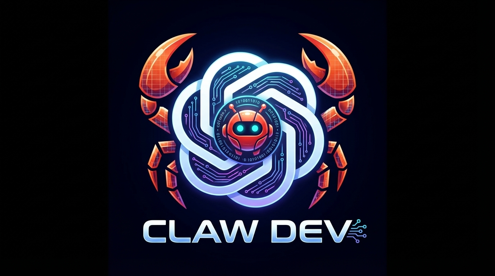

# Claw Dev



Claw Dev builds on the original launcher-first codebase and extends it with four connected surfaces:

- a browser GUI
- a terminal coding interface
- the original bundled launcher
- a Telegram bot

The original bundled launcher stays first-class. The browser GUI, direct TUI, and Telegram bot are layered onto that foundation so model selection, local tools, and provider behavior stay aligned across the whole project.

## Highlights

- ChatGPT Codex as the preferred OpenAI path when saved auth exists on the machine
- OpenRouter integration with live free-model refresh and strong free-model defaults
- Ollama integration with local runtime detection and installed-model discovery
- Telegram bot integration with token-first setup and managed bot start/stop
- macOS GUI service support through LaunchAgent
- desktop shortcut support on macOS through an explicit setup step
- local update checks against GitHub when the workspace is clean
- Workspace Studio inside the GUI with file browsing, editing, terminal access, preview, and run controls
- automatic workspace-aware file opening when the agent writes code in the GUI
- external launch support for graphical programs that should open in Terminal or a desktop window

## What Claw Dev Does Now

Claw Dev is now a local multi-surface coding environment with:

- a browser GUI for provider setup, chat, workspace editing, preview, updates, and Telegram control
- a direct TUI for local coding workflows
- the original bundled terminal launcher preserved as a first-class path
- a Telegram bot that can talk to the same coding engine remotely
- a local workspace IDE surface with:
  - file tree
  - editor
  - embedded terminal
  - run/test controls
  - browser preview support
- provider-aware model guidance for:
  - ChatGPT Codex
  - OpenRouter free and hosted models
  - Ollama local models
- desktop launchers and macOS service helpers
- a growing regression test suite around auth, providers, model catalogs, Telegram, and workspace behavior

## Surfaces

### GUI

Use the browser GUI for:

- provider setup
- model selection
- session control
- workspace selection
- chat-based coding
- file editing and browsing
- embedded terminal access
- local web preview
- run/test actions
- Ollama runtime status
- Telegram setup
- update checks

Launch it with:

```bash
npm run gui
```

### TUI

Use the terminal interface for focused local coding work.

Launch it with:

```bash
npm run tui
```

You can also run one-shot prompts:

```bash
npm run dev -- "summarize this repo"
```

### Bundled Launcher

Use the original bundled launcher when you want the heavier terminal workflow and behavior that came with the starting codebase.

Launch it with:

```bash
npm run claw-dev
```

This is the core path the project builds on.

### Telegram

Use the Telegram bot when you want the same coding engine available remotely.

Launch it with:

```bash
npm run telegram
```

Core commands:

- `/help`
- `/status`
- `/reset`
- `/provider openai`
- `/model gpt-5.2-codex`
- `/cwd /path/to/workspace`

## Providers

Claw Dev currently supports:

- OpenAI / ChatGPT Codex
- OpenRouter
- Ollama
- Anthropic
- Gemini

### OpenAI / ChatGPT Codex

Claw Dev prefers reusable local ChatGPT/Codex auth when available. If that is not present, it can fall back to `OPENAI_API_KEY`.

### OpenRouter

OpenRouter is treated as a first-class path with:

- free-model heartbeat refresh
- provider-qualified model ids
- curated free-model defaults
- clearer privacy / guardrail failure messaging when OpenRouter policy settings block a route

### Ollama

Ollama is treated as a first-class local path with:

- runtime detection
- installed-model discovery
- GUI setup for base URL
- coding-friendly local model choices

## Install

Requirements:

- Node.js 22+
- npm

Install dependencies:

```bash
npm install
```

## macOS Setup

Claw Dev does not silently install macOS services or Desktop shortcuts during a normal install.

When you want the full local app setup on macOS, run:

```bash
npm run setup:macos
```

That installs:

- the LaunchAgent-backed GUI service
- the Desktop shortcut

## Scripts

```bash
npm run gui
npm run gui:start
npm run gui:stop
npm run gui:status

npm run claw-dev
npm run tui
npm run dev -- --interactive

npm run telegram
npm run telegram:start
npm run telegram:stop
npm run telegram:status

npm run check
npm test
```

## Repository Layout

- `src/`
  - application source
- `scripts/`
  - GUI, Telegram, Desktop, and macOS service helpers
- `shared/`
  - shared auth and provider helpers
- `tests/`
  - regression and integration-oriented tests
- `bundled launcher directory`
  - the original bundled launcher and terminal client that the newer surfaces build on
  - on disk this currently lives at `Leonxlnx-claude-code/`
- `index.html`
  - browser GUI shell and frontend logic

## Recent Work

Recent project updates include:

- stronger Claw Dev coding-agent prompt assembly for the newer provider path
- OpenRouter and Ollama model selection improvements in the GUI
- OpenRouter free-model heartbeat and ranked defaults
- Telegram runtime checks and token-first setup flow
- GUI startup hardening through macOS LaunchAgent support
- workspace folder picking in the GUI
- Workspace Studio for files, editor, terminal, preview, and run actions
- Python workspace prep improvements for local game and script execution
- desktop launcher/icon improvements on macOS
- broader error handling and provider-timeout protection

## Still To Build

The highest-value follow-up work now is:

- chat file upload support in the GUI so users can drop in local files for analysis or editing
- chat image upload support in the GUI so screenshots or reference images can be processed directly in a conversation
- stronger frontend modularization so the browser GUI is split into smaller maintainable files instead of growing inside one large `index.html`
- continued IDE terminal hardening toward a more complete PTY-style experience
- more browser-level GUI smoke tests for real interaction coverage
- more polish on the right rail and studio micro-interactions
- richer attachment-aware agent behavior once file and image upload lands

## Notes

- The browser GUI is served locally at `http://127.0.0.1:4310` by default.
- Telegram readiness now means both valid bot auth and a live bot process.
- Telegram settings can be updated without re-entering the stored token unless you are rotating it.
- OpenRouter model availability can still depend on the account's privacy and guardrail settings at OpenRouter.
